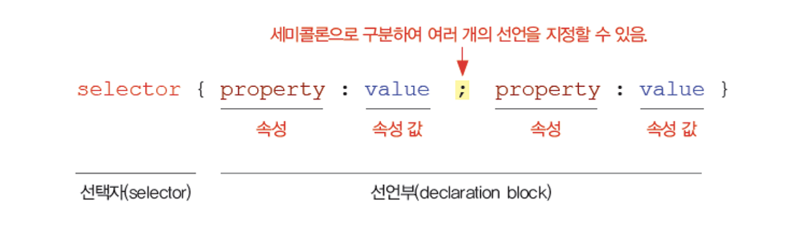
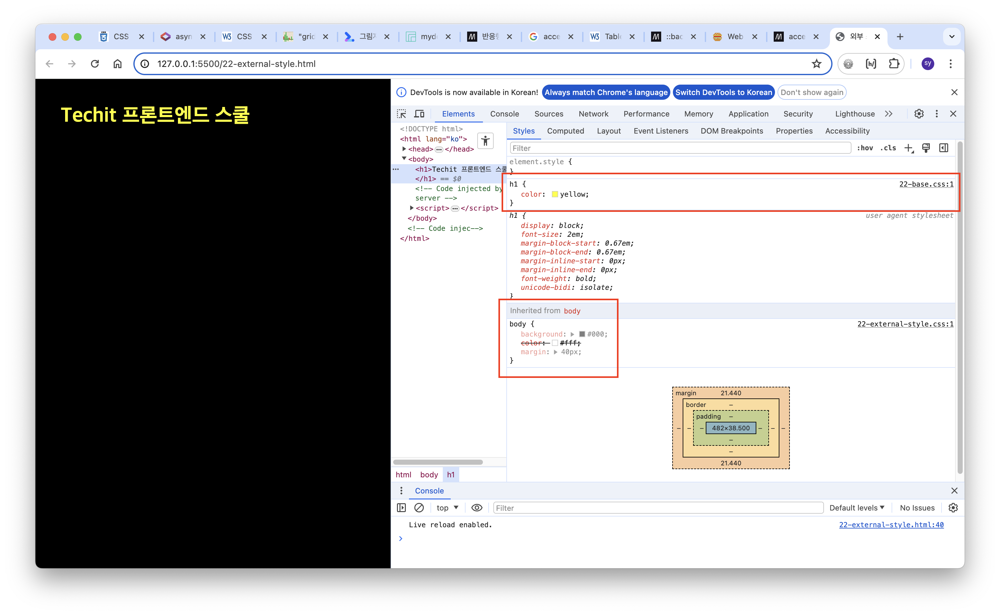

# CSS 실습

### CSS의 역사
- 여러개의 스타일이 겹치고 겹쳐서 마지막 스타일이 보인다
- W3C의 표준이며 레이아웃과 스타일의 자유도가 높은 언어
- CSS3 관점에서 새로운 모듈이 추가되었지만, 이전의 안정화된 모듈들은 기존 그대로 사용 → CSS1과 2는 단일 레벨로 표준화되었지만 최신 표준안을 통칭해서 CSS3라고 부른다
- HTML 문서에 어떤 모양을 랜더링 하느냐에 따라 다른 모양이 나온다~
- CSS 기본 문법
 

---
### external (22번 문서)
:link: 실습 파일 : [22-external-style]()
- 외부 스타일시트 2개를 만들어보고 각각 반영되도록 실습
- 개발자 도구 열어서 가장 위쪽에 반영된 스타일이 어떤것인지 점검 필요
 
- css, js 파일 모두 하나의 파일로 병합해주는게 좋지만 유지보수가 어려움 → 이후에 Sass 사용  
 
---

### embeded (23번 문서)
:link: 실습 파일 : [23-embeded-style]()
- HTML 문서 내부에 `<style>` 태그를 넣고 CSS 처리해주는 방식  
 
---

### inline (24번 문서)
:link: 실습 파일 : [24-inline-style]()
- 유지보수 최악!!
- 태그 안에 style 속성 추가하면 원하는 인라인 속성 추가  
 
---

### selector (25번 문서)
:link: 실습 파일 : [25-selector]()
- `*` 는 전체 요소를 의미하는 전체 선택자
- class를 식별할때는 선택자 앞에 `.` 을 붙여줌
- id를 식별할때는 선택자 앞에 `#` 을 붙여줌