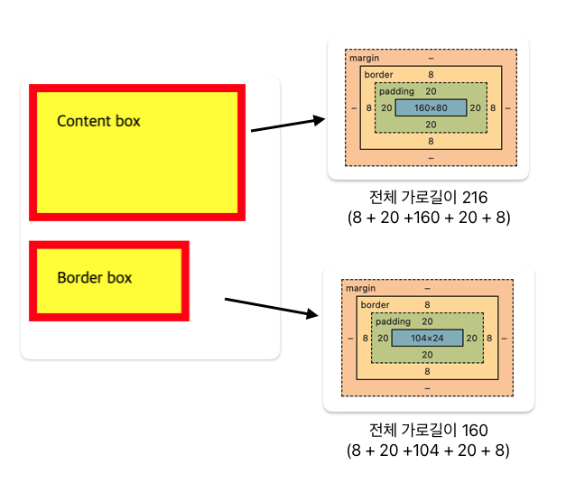
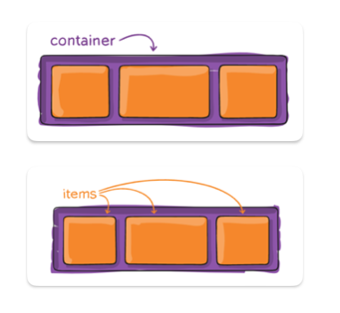

# box-sizing

### 속성값
- content-box (Default) : 지정한 width, height, padding, border값이 그대로 보여짐
- border-box : 지정한 width 값 안에 padding, border가 포함됨

```
div {
  width: 160px;
  height: 80px;
  padding: 20px;
  border: 8px solid red;
}
```


<br/>

# flex box

### flex container, flex items



- 컨테이너에 적용할 부분
  - `display: flex;`
  - `flex-flow: row nowrap;` : 아이템의 방향과 줄바꿈 처리를 지정해줌
  - `justify-content: flex-start;` : 축에 따른 정렬 속성
- item에 적용할 부분
  - `order: 1;` : item만 가질 수 있는 속성

<br/>

:link: 참고 링크 : https://css-tricks.com/snippets/css/a-guide-to-flexbox/

<br/>

# float

### float

- 개체가 떠있다!
- width는 내부 콘텐츠 크기만큼 auto로 자동 조절된다
- left, right, inline-start, inline-end 등의 속성을 선언하여 정렬 순서를 결정해줌

### clear

- float에 영향을 받지 않음
- float와 겹치지 않게 해제시킬 수 있다

<br/>

# position

- 요소들이 배치되는 방법을 지정
- relative, absolute 등과 같은 속성으로 __기준__ 을 잡고 top, left 등의 속성으로 __위치__ 를 지정

### relative

- 요소 자기 자신을 기준으로 배치

### absolute

- 가장 가까운 부모 요소를 기준으로 배치
- 문서상 원래 위치를 잃어버림

<br/>

# 가상 클래스

`:nth-child(n)` : 자식 요소 중에서 앞에서부터 n번째에 위치하는 자식 요소를 선택
```css
:nth-child(3)
/* 3번째 요소만 선택 */

:nth-child(n+5)
/* 5번째 요소, 6번째, 7번째 등.. 끝까지 모두 선택 */

:nth-child(-n+4)
/* 4번째 요소부터 앞으로 3번째, 2번째, 1번째 이렇게 앞쪽으로 모두 선택 */

:nth-child(n+4):nth-child(-n+8)
/* 4번부터 쭉 다음 요소들 선택하다가 8번 요소까지 선택되고 멈춤 */
```
:link: nth-child를 잘 이해할 수 있는 링크 : https://nthmaster.ru/

<br/>

`:nth-of-type(n)`: 특정 태그 중 n번째 태그를 선택

```css
div:nth-of-type(2)
/* div 요소 중 2번째 div 요소를 선택 */
```
:link: 참고하기 좋은 링크 : https://codingeverybody.kr/css-nth-of-type-%EA%B0%80%EC%83%81-%ED%81%B4%EB%9E%98%EC%8A%A4-%EC%82%AC%EC%9A%A9-%EB%B0%A9%EB%B2%95/

<br/>

# 의사 클래스, 의사 요소 (pseudo class)

- `:` : 요소가 어떤 특정한 상태일 때 해당 요소를 선택
  - `:hover` , `:focus` 등
- `::` : 요소의 특정한 부분에 대한 스타일을 만들때 사용
  - `::before` : 특정 요소의 앞에 다른 요소를 삽입할 때 사용
  - `::after` : 특정 요소의 뒤에 다른 요소를 삽입할 때 사용


