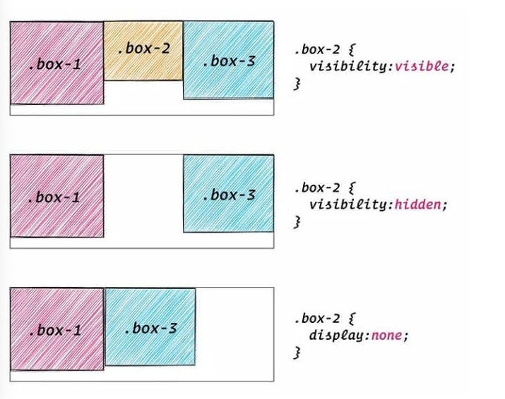
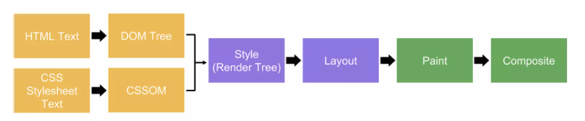

# display 속성

- inline : 인라인 박스
- block : 블록 박스
- inline-block : 인라인과 블록의 중간 형태, 줄바꿈은 되지 않지만 크기를 지정할 수 있음

### none

- 보이지 않음 (렌더링하지 않음)
- 레이아웃 공간을 차지하지 않음
- 웹 접근성 관련
  - 시각적으로 표시되진 않지만 접근성을 위해 필요한 요소를 none 처리하여 숨김
  - 숨김 제목이라는 것을 지정해주어야 함
- `visibility:hidden` 과의 차이점
  - `visibility:hidden` 은 보이지는 않지만 공간을 차지함

<br/>



<br/>

출처 : https://coding-factory.tistory.com/947#google_vignette

<br/>

# clip-path

다양한 형태로 모양을 만들어주는 clip-path 속성

- 여러가지 형태를 만들어볼 수 있는 사이트
  - https://bennettfeely.com/clippy/

<br/>

# 상대 경로, 절대 경로

### 상대 주소
- `./` : 같은 폴더
- `../` : 상위 폴더
- 하위 폴더 명인 경우 해당 폴더명으로 바로 시작

### 절대 경로

- 슬래시(/)로 시작 (루트 경로를 의미)
- 로컬에서만 정상 작동

<br/>

# background

색상, 이미지, 크기 등 배경 스타일을 지정

```css
background-image: url();
background-repeat: no-repeat;
background-position: 20% 30%;
background-size: 110px 83px;
background-attachment: scroll;

/* 단축 속성 */
background: pink url() no-repeat 20% 30% /110px 83px scroll;
```

참고 : https://designer-ej.tistory.com/entry/CSS-background-%EC%86%8D%EC%84%B1-%EC%A0%95%EB%A6%ACcolor-image-position-repeat-%EB%93%B1

<br/>

# 가상 요소 선택자

`::before` , `::after`
- 기본적으로 인라인 요소
- 요소의 앞(before)이나 뒤(after)에 콘텐츠를 삽입
```css
.box::before {
  content: "첫 번째 자식요소";
}

.box::after {
  content: "마지막 자식요소";
}
```

# Reflow, Repaint

### 브라우저의 렌더링 방식


그림 출처 : https://www.slideshare.net/wonjunhwang11/reflow-repaint-258821378

<br/>

- HTML, CSS 요소를 파싱하고, '렌더 트리' 를 구축 (DOM 트리 + 스타일 규칙 = 렌더 트리)
- 렌더 트리 순서로 레이아웃을 화면에 배치
- 생성된 레이아웃을 토대로 화면을 그림 (paint)
- 이렇게 그려진 레이어들을 합하여 웹 페이지로 보여짐

### Reflow

- 생성된 DOM 노드의 레이아웃이 변경되면 렌더 트리를 재생성(재배치)하는 것
- reflow 과정 이후 렌더 트리를 다시 그리는데 이를 repaint라고 한다.

### Repaint

- reflow 이후 발생할 수도 있지만, 꼭 그렇진 않음
- 레이아웃 수치에 영향을 주지 않는 `background-color` 같은 스타일 변경이 일어나면 reflow는 일어나지 않지만 repaint는 발생한다.

참고
- https://ykss.netlify.app/web/repaint_reflow/
- https://falsy.me/%EB%B8%8C%EB%9D%BC%EC%9A%B0%EC%A0%80%EC%9D%98-%EC%9D%B4%ED%95%B4-1-reflow-repaint%EC%97%90-%EB%8C%80%ED%95%98%EC%97%AC-%EC%95%8C%EC%95%84%EB%B4%85%EB%8B%88%EB%8B%A4/

# animation

animation-delay : 애니메이션이 시작할 시점을 지정
```css
/* 3초 뒤에 애니메이션 실행 */
animation-delay: 3s;
```

animation-direction : 애니메이션이 재생되는 방향을 지정
```css
/* 정방향으로 재생 */
animation-direction: normal;

/* 역방향으로 재생 */
animation-direction: reverse;

/* 정방향-역방향 재생 */
animation-direction: alternate;

/* 역방향-정방향 재생 */
animation-direction: alternate-reverse;
```

animation-duration : 한 사이클을 완료하는데 걸리는 시간
```css
animation-duration: 6s;
animation-duration: 120ms;
```

animation-fill-mode : 애니메이션 실행 후의 상태를 지정
```css
/* 상태 미지정 */
animation-fill-mode: none;

/* 끝난 후의 상태 그대로 유지 */
animation-fill-mode: forwards;

/* 처음 시작점으로 돌아옴 */
animation-fill-mode: backwards;

/* 앞 뒤 결과를 조합하여 설정 */
animation-fill-mode: both;
```
animation-iteration-count : 반복 횟수를 지정
```css
/* 무한 반복 */
animation-iteration-count: infinite;

/* 3번 반복 */
animation-iteration-count: 3;
```

animation-name : keyframe의 이름을 선언
```css
.box:hover {
  /* keyframe으로 만들어진 "rotate" 라는 애니메이션 이름을 선언해줌 */ 
  animation-name: rotate;
  animation-duration: 0.7s;
}

@keyframes rotate {
  0% {
    transform: rotate(0);
  }
  100% {
    transform: rotate(360deg);
  }
}
```

animation-play-state : 애니메이션 진행 상태를 지정
```css
/* 애니메이션 재생 중 */
animation-play-state: running;

/* 애니메이션 멈춤 */
animation-play-state: paused;
```

animation-timing-function : 애니메이션이 진행되는 방식 (속도 곡선을 지정)
```css
/* 빨라졌다가 느리게 끝남 */
animation-timing-function: ease;

/* 천천히 시작하여 빠르게 끝남 */
animation-timing-function: ease-in;

/* 빠르게 시작하여 느리게 끝남 */
animation-timing-function: ease-out;

/* 천천히 시작되었다가 빨라지다가 다시 느리게 끝남 */
animation-timing-function: ease-in-out;

/* 일정한 속도 */
animation-timing-function: linear;

/* 시작시에만 애니메이션이 실행됨 */
animation-timing-function: step-start;

/* 끝날때만 애니메이션이 실행됨 */
animation-timing-function: step-end;
```