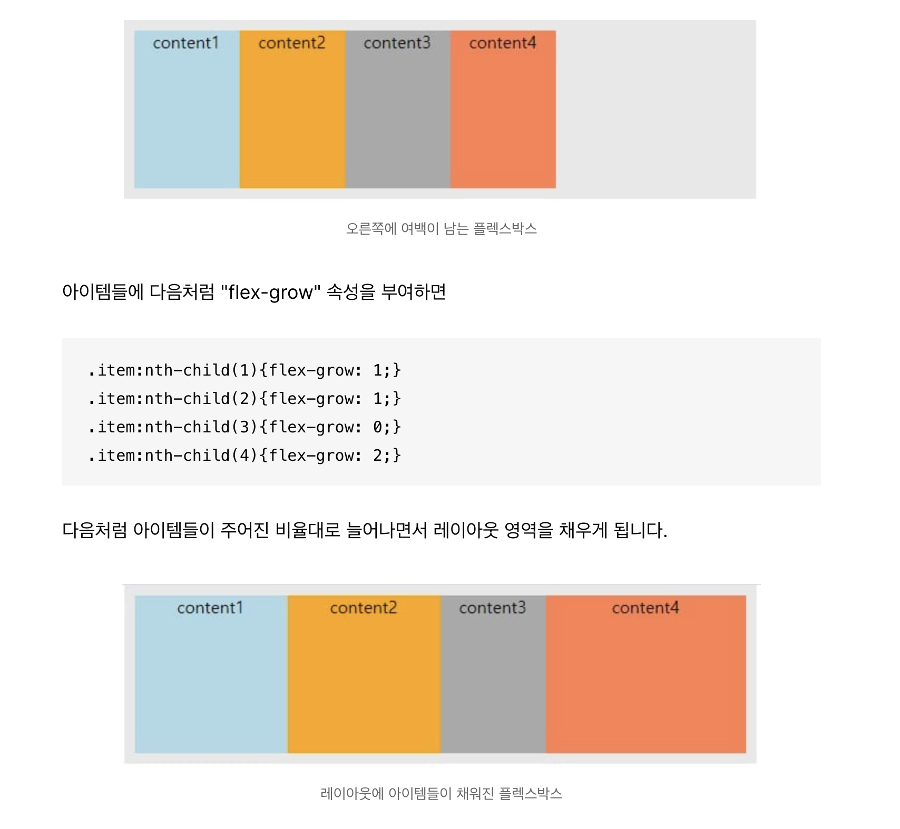

# form

정보를 제출하기 위한 상호작용을 할 수 있도록 하는 역할을 담당

- label, input, button, select, fieldset 등과 같은 태그를 사용하여 마크업
- 속성
  - method : 전송 방식
  - name : 서버에 전송될 이름
  - action : 서버의 url
  - target : 새 창으로 열도록 지정

<br/>

# fieldset

- 관련된 내용끼리 그룹화하는 태그
- legend : 그룹화된 fieldset의 제목을 정의 (폼의 목적을 명시)

<br/>

# box-shadow

```css
/* <offset-x> | <offset-y> | <blur-radius> | <color> */
box-shadow: 2px 3px 4px red;

/* <offset-x> | <offset-y> | <blur-radius> | <spread-radius> | <color> */
box-shadow: 2px 3px 4px 5px red;
```
- offset-x , offset-y 는 필수 속성값
- blur, color, spread, inset은 옵션값

참고 : https://codingeverybody.kr/css-box-shadow-%EC%86%8D%EC%84%B1-%EC%98%AC%EB%B0%94%EB%A5%B8-%EC%9D%B4%ED%95%B4%EC%99%80-%EC%82%AC%EC%9A%A9-%EB%B0%A9%EB%B2%95/

<br/>

# flex-grow

컨테이너 안에서 item 요소들이 이미 할당된 요소를 제외한 나머지 값만큼 영역을 확대



출처 : https://apost.dev/863/

<br/>

# white-space

- white-space: nowrap;
  - label 같은 태그에서 주로 사용. 요소 박스 내에서 텍스트가 줄바꿈처리 되지 않도록함

- flex-wrap: nowrap;
  - display: flex; 일 때 같이 사용. 요소 박스들 자체의 정렬을 제어. 박스 크기를 줄여서라도 줄바꿈되지 않도록함

<br/>

# :focus

input, button, a 태그 등 클릭이나 포커스를 받은 요소 자체
```css
/* & -> 중첩패턴 쓸 때 쓰임. 연결해서쓴다! */
&:focus { /* 버튼이 포커스 상태일 때 */
	outline: 5px solid red;
	
	/*
	outline-width:
	outline-style:
	outline-color: ...
	*/
}
```
outline을 0px로 주게되면 테두리가 안보이지만 접근성 향상을 위해 다음과 같이 정의하도록 하자
```css
&:focus-visible{
    outline: 2px solid green;
  }
```
클릭할때는 테두리가 보이지 않지만, 탭키로 포커스할땐 테두리가 보여진다!

<br/>

# @media

스타일 시트의 일부를 하나 이상의 미디어 쿼리 결과에 따라 적용
- 뷰포트 너비에 따라 스타일을 각각 적용

```css
/* 320px 이상의 디바이스에 적용 */
@media (min-width: 320px) {
  body {
    background: pink;
  }
}

/* 640px 이상, 800px 이하의 디바이스에 적용*/
@media only screen and (min-width: 640px) and (max-width: 800px) {
  body {
    background: lime;
  }
}
```