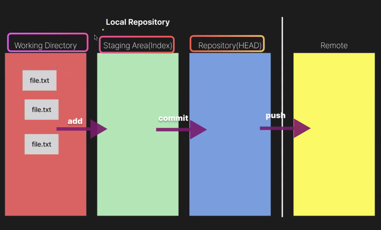
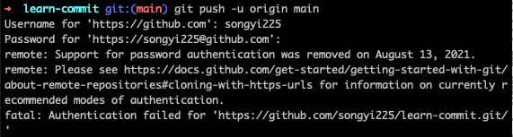
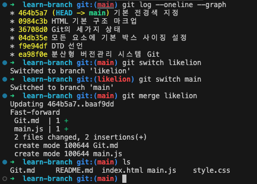
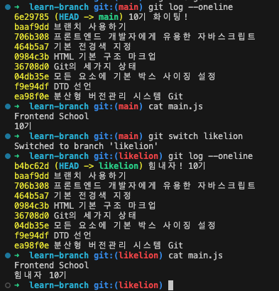
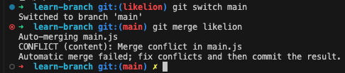
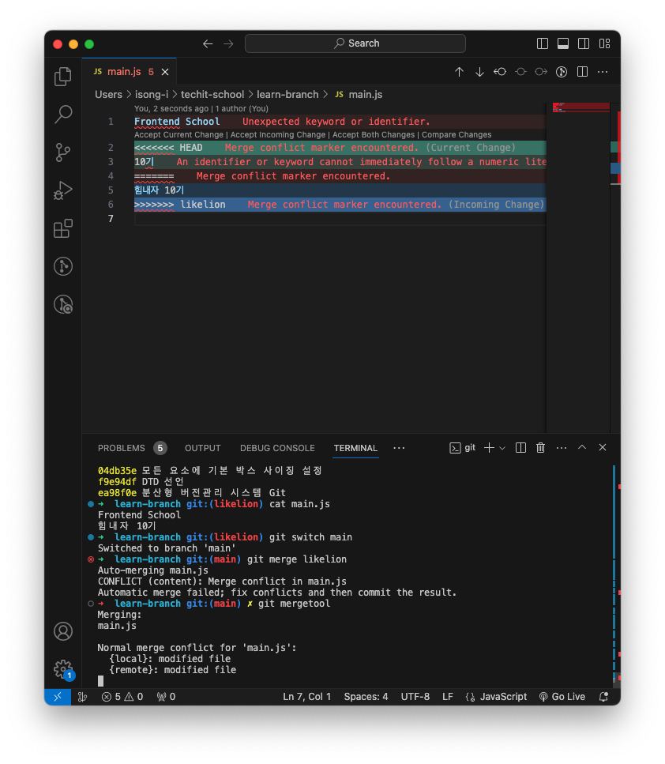
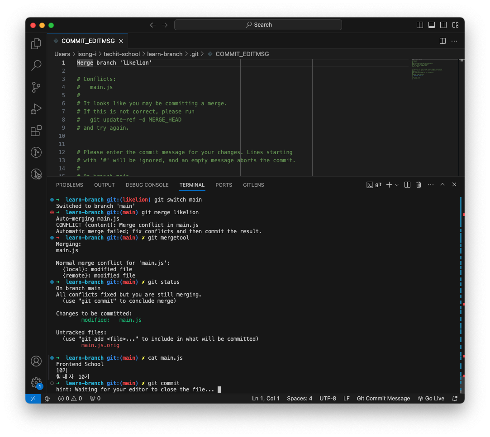
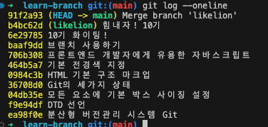
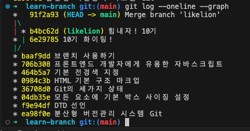

## Git CLI

### git init
- 저장소 안에 저장소를 만들 수 없음
- 루트 경로에서 git init 하지 않도록 주의하기
- 루트 경로에 해버리면 그 하위에 저장소 생성이 불가능함

### git add
- `git add *`  :*는 모두를 선택하여 add하겠다는 의미
- `git add .` : .은 현재 디렉토리 의미
  - 현재 디렉토리 안에 변경사항을 모두 선택해서 스테이지 올리라는 의미
  - 그러나 5개 중 1개만 올리고 싶은데 .를 잘못 입력하면 전부 올라가니까 조심히 사용해야함

### git restore
- 되돌리는 기능 → 현재 어느 상태인지를 항상 체크해주어야함

  - working directory에서의 restore 명령 : 수정한 내용이 날아감
  - staging area에서의 restore 명령 : 워킹 디렉토리로 이동하는 것

### git commit
- 파일의 변경 사항을 확정
- 변경 이력 생성
- commit 메세지 : 의미를 담아야 함

### git push -u
- push : 밀어서 보내주세요
- u : 업스트림
- origin : 보내는 주소의 별칭
- main : 메인 브랜치를 푸시해주세요
  __:warning: push 중 오류 발생__
  
 → https://dev.classmethod.jp/articles/resolving-github-token-authentication-errors/ 참고하여 토큰 발급
 → push 후 password를 토큰으로 입력하고 완료

### git remote
- `cp -r learn-commit learn-reset` : 로컬에서 로컬로 복사
    - `git remote -v` 하면 현재 연결된 원격저장소 주소를 볼 수 있음
    - `git remote rm origin` 하면 원격저장소 주소 연결해제
- `git clone git원격주소 learn-reset2` : 원격에서 로컬로 복사

### git reset
- 마지막 커밋 만들기 이전으로 이동할 수 있다
    - `git reset --mixed` : 커밋을 취소하면서 워킹 디렉토리로 옮겨짐 (add이전) → 코드 내 오타 or 추가와 같은 내용 수정이 필요할 때
    - `git reset --soft` : 커밋을 취소하면서 스테이지로 옮겨짐 (add이후) → 커밋명만 수정하고 싶을 때
    - `git reset --hard` : 커밋과 내용을 모두 삭제할 수 있다
- 즉, 모두 reset 시켜서 커밋을 다시 할 수 있음
- 여러 파일을 낱개로 커밋하지 않고 여러개의 파일을 한번에 커밋할 수 있음

### git checkout, branch
- checkout = switch와 유사한 기능
- git switch -c techit → 브랜치 새로 생성하고 이동까지 가능

### git merge
__fast-forward merge__
  
  
__3-way-merge__
- 같은 파일이고 각각의 브랜치에서 다른 내용을 커밋하고 머지할때

- main.js 파일 충돌

- 수동으로 충돌난 부분을 수정해서 머지해야함 → CLI창에서 작업하기 힘들기 때문에 머지툴을 vsc로 설정해둠

  
- 같은 줄을 수정
  - current change → 현재 (메인 브랜치)
  - incoming change → likelion 브랜치
  - both → 둘 다 필요 시 선택

- 합쳐진 병합 커밋이 만들어짐 (최종)

- 그래프 형태로 보면 아래와 같다

