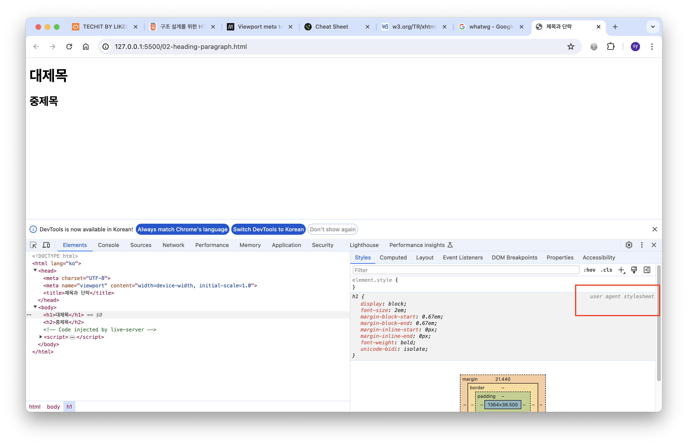
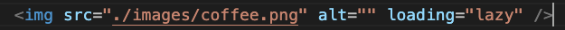
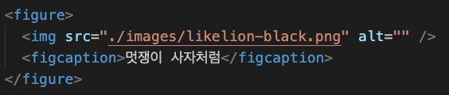

# 웹접근성과 웹표준

### Internet
- Telnet : 원격 접속 서비스
- Usenet : 관심사에 따라 카테고리 별로 묶어놓은 채널 (다음카페, 네이버카페 등)
- FTP : 파일 송수신 프로토콜 / 개발한 것 서버에 전송할때 쓰일수도
- IRC : 메신저 프로그램 (MSN, 네이트온 이전의 채팅 프로그램 - 모르는 사람들끼리 연결)
- Archie, Gopher : 검색 서비스 (구글, 네이버 이전의 것)
- WWW : 위에 모든 것들이 웹 하나로 들어옴 / 인터넷 서비스인 웹

### Frontend
- HTML5 : 건강한 신체 (뼈대를 만들어주는 기술)
- CSS3 : 근사한 스타일링
- JS : 스마트한 두뇌
- 추천도서 : 제프리 젤드만의 웹표준 가이드

### Web Accessibility (웹 접근성)
- 장애인/비장애인도 웹에 접근해서 사용할 수 있어야 한다. 웹을 독점적으로 소유하는게 아니라 공유하는 것  
<br/>
<br/>

# HTML 실습


### Metadata (01번 문서)
:link: 실습 파일 : [01-metadata](https://github.com/songyi225/html-css/blob/student/01-metadata.html)
  
- 브라우저가 내장하고 있는 DTD에 근거하여 해석한다
- 표준/호환모드를 구분하는데도 영향을 줌
    - 호환 모드가 되는 순간 크로스 플랫폼에서 일관된 UI를 기대하기 어려움 (레이아웃 틀어짐, 기능 동작하지않음 등) → 표준모드로 랜더링되지 않음
    - 랜더링 : 내가 짠 소스대로 그려내는 것
<br/>

`<meta>` 태그

```
<meta charset="UTF-8" />
<meta http-equiv="Content-Type" content="text/html;charset=UTF-8" />
```
→ 같은 의미의 char 설정
```
<meta name="viewport" content="width=device-width, initial-scale=1.0" />
```
- viewport : 화면 크기
- width : 디바이스 가로 크기
- initial-scale : 핀치인/아웃 제스처의 초기 배율  

<br/>

---

### heading (02번 문서)

:link: 실습 파일 : [02-heading](https://github.com/songyi225/html-css/blob/student/02-heading-paragraph.html)
  

- h1, h2 와 같이 정의된 태그 : user agent stylesheet로 정의된 기본 스타일이 적용되어있음  
<br/>

---

### figure (03번 문서)

:link: 실습 파일 : [03-figure](https://github.com/songyi225/html-css/blob/student/03-image-figure.html)

- html 만든 문서에 문법검사 해보기 → 크롬 확장프로그램 Web Developer 통해서 코드 검사 가능
- Screen Reader(스크린리더) : 음성으로 읽어주는 것 → 이때 대체텍스트 정보가 중요함 (alt 속성!)
- lazy loading 적극적으로 사용 : 성능에 영향을 줌
<br/>
- figure : 캡션을 가지고 있는 그룹
  - 이미지 태그와 같이 자주 쓰임
<br/>