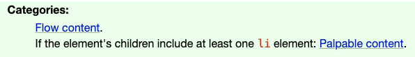

# 웹접근성과 웹표준

- DOM : 표준 기술에 포함됨
- 웹접근성 : 법적 의무사항이며 모든 상황과 다양한 사람들을 고려하여 설계해야하는 습관을 들이자
- div, span 요소는 키보드 접근이 불가하다
- a, button 같은 요소를 쓰면 키보드로 접근이 가능
- 즉, 마우스 없어도 조작할 수 없을지를 고민해보는게 좋음
    - tabindex를 활용
    - button, click 속성 사용
- `<html lang=”ko_KR”>` : 같은 한국어지만 다른 지역(북한..)도 있기 때문에 디테일하게는 _KR도 붙일 수 있다
- HTML DTD, Metadata 등 관련 내용 참고
  → https://web.dev/learn/html/welcome?hl=ko  
 

# HTML 실습

### ul, li (04번 문서)
:link: 실습파일 : [04-unordered](https://github.com/songyi225/html-css/blob/student/04-unordered-ordered-list.html)

- ul 요소는 하나 이상의 li 요소를 가질 수 있다
- ul 요소 안에 아무것도 들어오지 않거나, 텍스트만 입력하거나, ul 안에 div 요소가 들어오면 안됨

 

---

### definition (05번 문서)

:link: 실습파일 : [05-definition](https://github.com/songyi225/html-css/blob/student/05-definition-list.html)

- table 태그를 사용할 수 있으나, 반응형 대응을 위해 좁은 ui 패턴에서도 깨질 위험이 낮은 정의형 list로 마크업
- 예: `<dl>`, `<dt>`, `<dd>`

 

---

### section (09번 문서)

:link: 실습 파일 : [09-section](https://github.com/songyi225/html-css/blob/student/09-section-main.html)

- HTML은 위에서 아래 방향으로 마크업함 (선형화)
- 그룹화하기보다는 가장 먼저 머리말 영역을 마크업해서 판단 (순서대로)
- `<header>` : 상단 머리말
- `<nav>` : 메뉴바
- `
` : 콘텐츠 + 부가정보 전체를 묶음
- `<main>` : 콘텐츠를 묶음
  - `<section>` : 1장 1절, 1장 2절...
  - `<article>` : 독립된 정보
- `<aside>` : 부가 정보 (위젯 등)
- `<footer>` : 하단  
 

---

### container (10번 문서)

:link: 실습 파일 : [10-container](https://github.com/songyi225/html-css/blob/student/10-container-element.html)

div 블록 단위

인라인 상자의 특징 (텍스트도 인라인 상자)

span 인라인 요소

