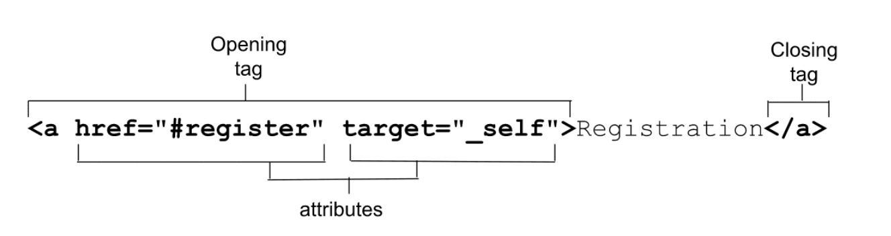
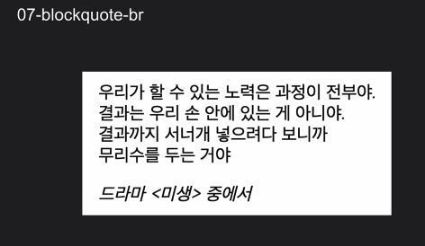
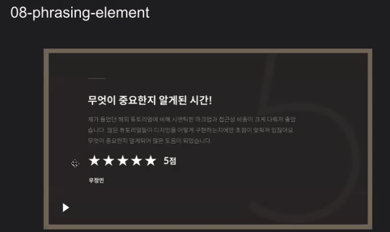
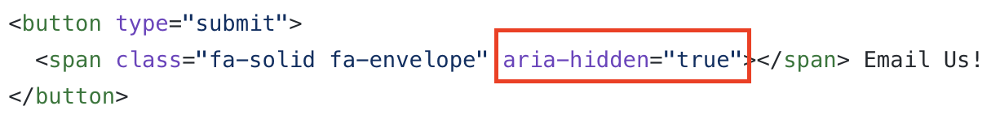
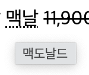
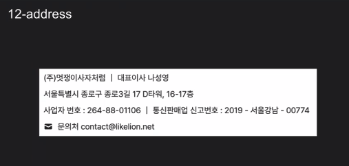
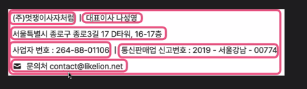

# HTML 실습

### anchor (06번 문서)
:link: 실습 파일 : [06-anchor](https://github.com/songyi225/html-css/blob/student/06-anchor.html)

이미지를 클릭했을 때 이동하는 이미지 앵커 마크업 필요
 

- 하이퍼링크 `<a>` 태그
  
- href : url도 연결되지만 id 방식으로 연결도 가능함 → 프레그먼트 식별자 방식
- download 속성 사용하여 다운로드 기능도 가능
- target 속성
    - _self
    - _blank : 새 창 열림
        - _를 빼고 코딩하거나 blent 등 다른 오타여도 새 창으로 열림
        - 타겟을 특정한 이름으로 열어주고 또 동일한 이름으로 타겟지정되었다면 새창으로 열지않고 그 창에서 다시 열림
    - _parent
    - _top

---
### blockquote (07번 문서)
:link: 실습 파일 : [07-blockquote](https://github.com/songyi225/html-css/blob/student/07-blockquote-br.html)

다음과 같은 문서를 마크업해보자!
 

- <미생>은 기울임꼴 : i 태그도 있지만 em 태그도 강조하는 느낌으로 사용한다 (시맨틱 마크업)
- 첫 문단을 p 태그로 마크업하고 전체를 인용문으로 마크업
- 현업에서 자주 쓰이는 태그
  - div
  - a
  - img
  - form (button, input, select)
  - 이 외에는 자주 쓰이지는 않는듯
- 코딩 중 텍스트 안에 <나 > 기호를 쓸 때는 엔티티 코드를 넣어주는 것이 좋다!
   - &lt; ⇒ <
   - &gt; ⇒ >
   - 태그처럼 보이는 `<em>`을 그냥 텍스트문자열로 출력하고 싶다면 `&lt;em&gt;` 로 적어주면된다
   -  [링크](https://www.w3schools.com/html/html_entities.asp) : html 문서 안에서 반드시 치환되어야할 엔티티 코드 안내   → < , > , 공백 등등.. 이 문서에 나와있는 캐릭터들 만이라도 조금 기억해두기

---
### phrasing (08번 문서)
:link: 실습 파일 : [08-phrasing](https://github.com/songyi225/html-css/blob/student/08-phrasing-element.html)

다음 화면을 마크업해보자!
 

- 아이콘 폰트 font awesome → 아이콘 폰트 사용할 때 i 태그 많이 사용하는데 span 태그를 사용하도록 하고, 스크린리더에서 읽어주지 않았으면 하는 부분은 aria hidden 속성 추가해주기!!
- span 태그 : 의미는 없지만 접근성 관련 사례
- 스크린리더 사용자를 위한 착한 마크업(4번 영상 참고)
 
 스크린리더가 읽어주지 않는 부분

---
### text-level (11번 문서)
:link: 실습 파일 : [11-text-level](https://github.com/songyi225/html-css/blob/student/11-text-level-element.html)

- `` : 아래 첨자 (화학기호 등)
- `` : 윗 첨자 (각주 등)
- `<mark>` : 하이라이트 처리 (문서에서 텍스트 찾을 때 하이라이트처리되는 기능)
- `<time>` : 글을 올렸을 때 방금, 1일전, 한달전 이런식으로 나오는 경우. 오늘 날짜와 time 안의 날짜를 연산! time 태그 없이도 만들수는 있음.. datetime이 가지고 있는 속성값만 뽑아내면 시스템 시간과 연산이 가능하다 → 시멘틱 태그!
    - 부트캠프 출신으로 성장을 원하는 개발자임을 나타내야함!!!! .. 과거에는 이러했는데 datetime을 사용해서 개선해보았습니다.. 시스템 시간과 연산시켜.. 어쩌구
- `<abbr>` : 마우스오버하면 툴팁(보충설명, 대체설명)을 보여줌. abbr 태그는 title 속성의 축약어야!
 
- `<s>` : 취소선
    - 좀 더 시멘틱한 태그
      - `<ins>` , `<del>` → 할인상품에대한 원가랑 세일가격 이런거 표기할때 사용 가능
      - `<code>` → 특정 코드에 대한 예시를 나타낼 때 (텍스트가 아니라)
      - `<data>` → 시간과 날짜를 나타냈지만 지금은 time을 사용중
      - `<kbd>` → ctrl+c 누르세요 하는 것처럼 키보드 동작을 요구할때

---
### address (12번 문서)
:link: 실습 파일 : [12-address](https://github.com/songyi225/html-css/blob/student/12-address.html)

다음 화면을 마크업해보자
 
- 멋쟁이사자처럼 뒤에 | 같은 요소는 aria-hidden 사용해도 좋다!
- 연락 가능한 정보들을 `<address>` 태그로 마크업해주면 좋다
- 각각의 컨텐츠들을 span 태그로 구분
 
- address 태그도 기울임꼴을 유저 에이전트 스타일시트로 가지고 있음
- `<address>` 태그는 보통 푸터 영역에 쓰이는 태그 → 본문에 들어가는 정보가 되어서는 안됨!
- address와 함께 저작권 관련 카피라이터 정보는 `<small>` 태그 사용 → 참고 링크 : [small_mdn](https://developer.mozilla.org/ko/docs/Web/HTML/Element/small)