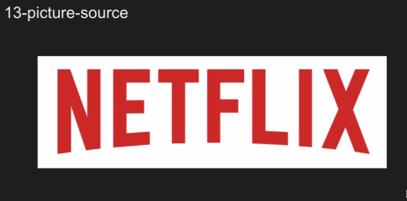
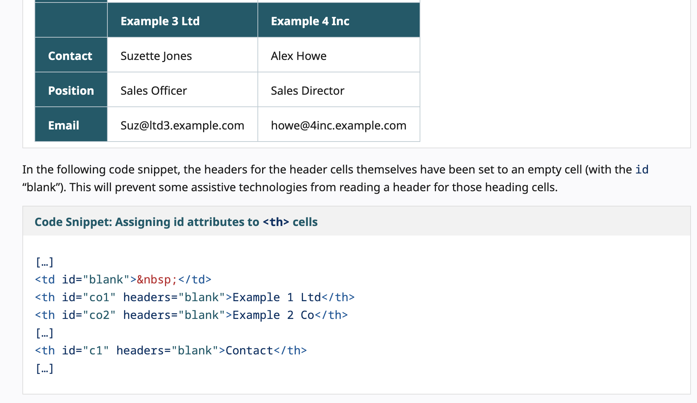
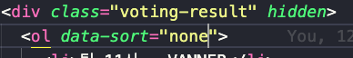

# HTML 실습

### Picture, Source (13번 문서)
:link: 실습 파일 : [13-picture](https://github.com/songyi225/html-css/blob/student/13-picture-source.html)

로고 이미지를 picture와 source를 이용하여 마크업
  
- `<source>` 태그의 srcset 속성 : 이미지 파일 세트
- 사용자의 해상도에 맞는 source를 골라 이미지를 보여준다
- 개발자도구를 이용하여 뷰포트, 배율을 수정하면서 확인 (실습파일 확인)  

:question::question: 현업에서는 해상도별 이미지 다 확인하면서 짜야하는가.. :cry:

---

### video (14번 문서)
:link: 실습 파일 : [14-video](https://github.com/songyi225/html-css/blob/student/14-video-source.html)
- `<video>`
    - controls : 비디오 컨트롤바를 보여줌
    - autoplay 옵션 줄때는 muted도 같이 주어야 자동재생됨 → muted 없으면 자동재생 안되어야함 :: **접근성 정책 때문에 자동재생 불가능!!**
- `<track>` : 자막  
 

---

### iframe (15번 문서)
:link: 실습 파일 : [15-iframe](https://github.com/songyi225/html-css/blob/student/15-iframe.html)
- iframe 태그
    - title은 글로벌하게 쓰이기 때문에 접근성 관련해서 aria-label 로 속성을 활용해주는게 좋다  
 

---

### map (16번 문서)

:link: 실습 파일 : [16-map](https://github.com/songyi225/html-css/blob/student/16-map-area.html)

- 이미지 맵을 통해 이미지 영역(area)별로 영역을 마크업
- svg 코드도 img 그대로 삽입 가능 → 이미지 자원을 따로 요청하지 않기 때문에 최근에 요런 패턴도 자주 쓰인다
    - svg 는 alt 를 쓸 수 없으므로 aria-label로 대체 텍스트 선언  
 

----
### table (17번 문서)
:link: 실습 파일 : [17-table](https://github.com/songyi225/html-css/blob/student/17-table.html)
- 다양한 태그를 사용하여 테이블 영역을 묶어준다
  - thead
  - tfoot
  - tbody
  - scope : 영향을 주는 방향 설정 가능
- https://www.w3.org/WAI/tutorials/tables/ → 여러 테이블 사례
 
 

---

### form (18번 문서)
:link: 실습 파일 : [18-form](https://github.com/songyi225/html-css/blob/student/18-form.html)

- `form`은 사용자가 입력/선택한 데이터를 가지고 서버와 상호 교류가 가능 (인터렉티브 컨텐츠)
- action 속성 : 폼관련 영역에 선택/입력 시 전달되는 서버의 주소
- method 속성 : 클라이언트에서 서버로 전송할 때 get, post 방식을 사용하고 Default로 get 방식 사용
    - get : 데이터를 받아오는것
    - post : 데이터를 보내는것
- `fieldset` 태그 : xhtml에선 필수, html4버전에선 생략가능, 현재도 생략하는 경우 많음
    - div와 비슷한 의미 (묶어놓는 영역) → div는 의미없이 묶음
    - `fieldset`은 연관성이 있는 폼 서식을 묶어놓을때 사용
    - `fieldset` 과 `legend` 셋트로 같이다님
- `label`과 `input` 태그를 묶어놓음 (형제 레벨)
- `input` → type에 따라 서식의 모양이 결정된다
    - select 박스 서식
    - textarea : 여러 줄 글상자 서식
- 모든 폼 서식은 반드시 1:1로 대응되는 레이블을 가지고 있어야한다
- `<button type>` : 기본적으로 생략되어도 submit
    - 만약 자바스크립트 함수를 구동시킬 함수인데도 불구하고 생략하는 경우가 있음
    - 가급적이면 전송하는 역할이 아니라 구현할 목적이면 버튼의 타입은 button
    - button이 form 밖에 있어도 form id와 연결해두면 동작이 가능

❓❓label을 쓰는게 좋은지 aria-label이 좋은지.. label은 사용자에게 보여지고 aria는 안보여지는건지? 둘다쓰는건안되나??
> WAI-ARIA 접근 가능한 이름 (Accessible Name)에 대해 찾아보시면 좀 더 이해하실 수 있을텐데요
> 
> 접근 가능한 이름은 우선 순위가 있습니다.
> 1. aria-label
> 2. aria-labelledby
> 3. aria-describedby
> 4. title
> 
> title은 제공되는 접근가능한 이름이 없을 때 최후의 수단으로 읽는 정보입니다.
> 
> 가급적이면 title이 아니라 aria-label을 사용하는 것이 좋습니다.
> 
> 다만 title 속성이 마우스를 사용하는 User 입장에서 정보를 식별하기 용이한 방법일 수 있다면 aria-label과 함께 제공할 수도 있습니다.
>
> https://www.w3.org/WAI/ARIA/apg/practices/names-and-descriptions/
>
> => 슬비쌤 질의응답방 답변

---

### interactive_element (19번 문서)
:link: 실습 파일 : [19-interactive](https://github.com/songyi225/html-css/blob/student/19-interactive-element.html)

- 다이얼로그 창
    - 다이얼로그의 레이블을 다른 태그와 aria-*labelledby*로 연동할 수 있다
    → 워드, pdf 파일 등에 요거 사용하면 접근성 좋다
    - open 속성 : 요거 없으면 다이얼로그가 화면에 나타나지 않음
    - 다이얼로그 요소의 장점 : 레이어 팝업 외에 딤드된 영역에서 클릭이 안됨
- details / summary
    - open 속성 : 자세한 요약정보가 펼쳐져있도록
    - summary : 요약된 정보를 포함
    - figure : 이미지를 묶어놓는 용도 (div, span 써도 무방)    
 

---

### scripting (20번 문서)
:link: 실습 파일 : [20-scripting](https://github.com/songyi225/html-css/blob/student/20-scripting.html)
- html은 돔트리 순차적으로 파싱하다가 브라우저가 script 태그를 만나면 파싱(해석)을 중단해버림 → scipt파일을 다운로드 받으려고함 → 다운로드 끝나면 그 뒤에 아래 내용을 파싱함
- defer 라는 옵션을 추가해주면 동작이 됨
    - defer를 만나는 순간 스크립트 파일을 다운로드를 중단하고 그 이후에 파싱하고 파싱이 완료되면 스크립트를 다시 다운로드
    - async는 반대
    - __보통 defer선언 굳이 하지 않고 type을 module로 처리하면 디퍼처럼 처리__  
 

---

### interactive_attribute (21번 문서)
:link: 실습 파일 : [21-interactive_attribute](https://github.com/songyi225/html-css/blob/student/21-interactive-attribute.html)

- 유저 인터렉션 속성 : 사용자와 상호작용
    - hidden : 돔트리 파일에 랜더링되지 않도록 숨겨진 상태
    - tabindex : 포커스를 받을 수 없는 비포커서블 객체가 포커스를 받을 수 있도록 할때 숫자주는것
        - 앵커말고 div는 포커스될 수 없다
        - -1 음수면 포커스를 받을 수 없는 객체
    - accesskey : 전역 속성. 운영체제 단계에서 단축키를 제공 (https://developer.mozilla.org/ko/docs/Web/HTML/Global_attributes/accesskey) 참고하여 단축키 확인 가능
    - contenteditable : 동적인 의미를 가지는 전역 속성. 포커서블 객체가됨
    - draggable
- 사용자 정의 속성 : 표준에 존재하지 않는 속성을 html에 인위적으로 속성을 추가해서 쓸 수 있다. 다만, “data-%%%” 와 같은 형식으로 data-로 시작되어야함

 
