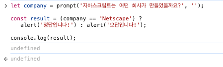

Operations

# 비교 연산자

### 문자열 비교

- 사전 순서 (정확히는 유니코드 순)로 비교하고 사전 앞쪽의 문자일수록 크다고 판단
- 특이점 : 대문자 `A` 와 소문자 `a` 를 비교했을때는 소문자 `a` 가 더 크다 → 유니코드 상 소문자가 더 큰 인덱스를 가지고 있어서

### 다른 형을 가진 값 간의 비교

비교값끼리 자료형이 다르면 '숫자형'으로 형변환을 한 다음 비교함

```js
let a = 0;
alert(Boolean(a)); // false

let b = "0";
alert(Boolean(b)); // true

alert(a == b); // true!
```

→ a 와 b 각각의 불린값은 false와 true이므로 두 개를 비교했을 때 false가 나오지 않을까? 했는데 true가 나옴!!!!!!
→ 동등비교 연산자를 (`==`) 사용할때 문자열 0을 숫자형 0으로 변환하기 때문에 숫자 0 과 0을 비교하게되어 true를 반환함
→ 이 혼란을 해결하는 것이 일치연산자!

### 일치 연산자

```js
// 동등 연산자는 숫자형으로 변환하고 비교
alert(0 == false); // true
alert("" == false); // true

// 일치 연산자는 형변환없이 비교
alert(0 === false); // false
alert("" === false); // false
```

### null, undefined

```js
// 동등 연산자 -> 특별한 규칙이 적용????
alert(null == undefined); // true
// null 숫자형은 0
// undefined 숫자형은 NaN

// 일치 연산자
alert(null === undefined); // false
```

### 함정 피하기

- 특별한 null과 undefined : 일치연산자를 제외한 비교 연산자의 피연산자에 얘네들은 오지 않도록 주의하기...!!
- 만약 변수가 `undefined`나 `null`이 될 가능성이 있다고 판단되면, 이를 따로 처리하는 코드를 추가하시기 바랍니다.
  → validation 적용을 의미. 보통 if문으로 만들어줌

---

Condition

# 조건문

```js
let year = prompt("ECMAScript-2015 명세는 몇 년도에 출판되었을까요?", "");

if (year == 2015) alert("정답입니다!");
```

→ 프롬프트 통해 들어온 값은 숫자로 형변환되서 비교되는건가???

### 불린형으로의 변환

- falsy한 값 : 숫자 0, 빈 문자열 `''`, null, undefined, NaN → 불린형으로 변환 시 `false`
- truthy한 값 : 안에 데이터 들어있는 경우. falsy한 값 이외의 값 → 불린형으로 변환 시 `true`

### 조건부 연산자 (삼항식)

값을 반환하는 삼항식!

```js
let age = prompt("나이를 입력해주세요.", 18);

let message =
  age < 3
    ? "아기야 안녕?"
    : age < 18
    ? "안녕!"
    : age < 100
    ? "환영합니다!"
    : "나이가 아주 많으시거나, 나이가 아닌 값을 입력 하셨군요!";

alert(message);
```

→ 조건을 비교하고 true가 하나라도 떨어지면 그 메세지를 message 변수 안에 넣어주는것
→ 조건이 너무 많아지면 if .. else로 풀어쓰는게 가독성은 좀 더 높임.
→ 다만 if else 문을 사용할 땐 값이 반한되지 않음. 별도로 한번 더 반환해주는 것을 써줘야함

### 부적절한 삼항식



- 참이면 `alert('정답입니다!')` 함수가 실행되는데 이 때 이 함수는 안에 return값이 없으므로 undefined를 반환함
- 여기서 `const result`는 굳이 의미가 없기 때문에 생략해주어도 상관은 없음!

### 다중삼항식 예제

```js
let didWatchMovie = "no";
let goingToWatchMovie = "yes";

const message =
  didWatchMovie === "yes"
    ? "그 영화 참 재밌더라"
    : goingToWatchMovie.includes("yes")
    ? "언제 볼까? 재밌겠다."
    : "그래..";

console.log(message);
```

`.includes('yes')` → didWatchMovie 안에 'yes'라는 글자가 들어있느냐! include는 문자의 메서드.

<br/>

#### :heavy_plus_sign: 삼항식으로 값을 내보내는 것만 보여준것

```js
function render(node, isActive) {
  let template = `
    <div>${isActive ? "안녕~~!!" : "잘가~~!!"}</div>
  `;
  node.insertAdjacentHTML("beforeend", template);
}
```

- `render(document.body,'안녕ㅋㅋㅋ')` → 안녕ㅋㅋㅋ 라는 글자가 문서에 표시됨
- `render(document.body,true)` → true 이므로 '안녕' 글자가 표기됨
- 다만, 저 안에는 식이 와야하기 때문에 if문이 들어갈 수는 없다.

---

Condition

# 논리 연산자

### OR ( || )

첫번째 truthy를 찾는 OR

```js
let whichTruthy = false || "" || [2, 3].length || { thisIsTruthy: true };
console.log("whichTruthy: ", whichTruthy);
```

- 일단 [2, 3].length 라는 값을 내뱉는게 맞음 → 그런데 얘는 이미 안에서 2로 값을 계산해주고 || 를 만나서 이 때 true로 변환
- 그래서 변환전 값인 2가 반환됨!

### AND ( && )

첫번째 falsy를 찾는 AND

```js
let whichFalsy = true && " " && [] && { thisIsFalsy: false };
console.log("whichFalsy: ", whichFalsy);
```

- 빈 배열 [] 은 true → 배열 안에 항목이 비어있지만 배열이라는 항목은 살아있기 때문에
- { thisIsFalsy: false } 은 true → 객체 자체가 있어서. {} 만 해도 true

### NOT ( ! )

피연산자를 불린형으로 변환하고 그 값의 역을 반환

### 우선순위

! > && > ||
