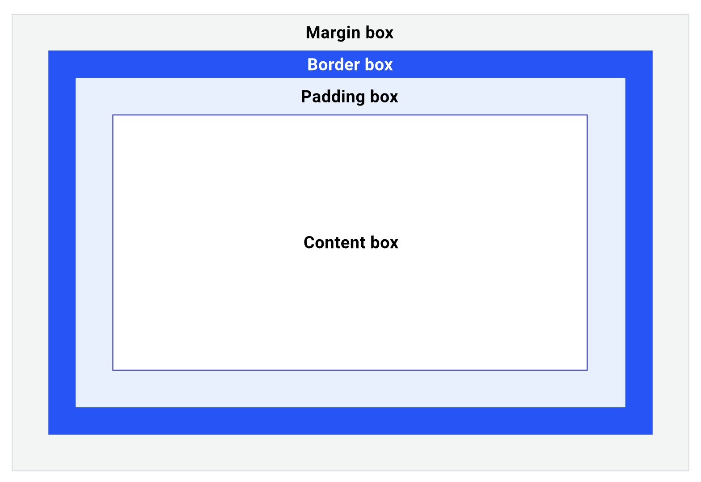
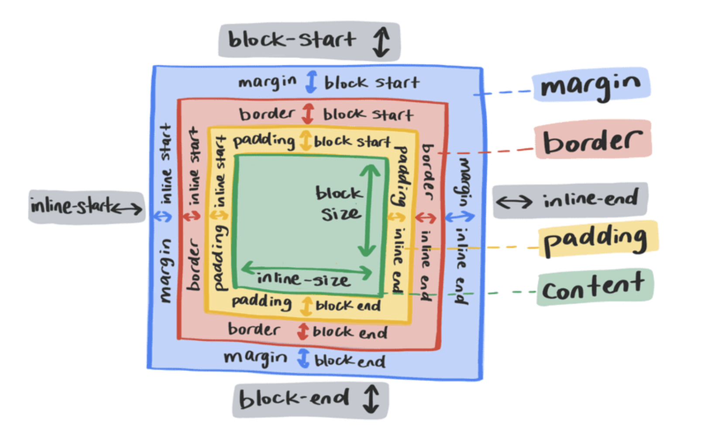

# 박스 모델

### 기본 박스 모델 논리 구조


<br/>
- width : 가로
- height : 세로
- padding : 박스 테두리 안쪽 영역
- margin : 박스 테두리 바깥 영역
- border : 박스 테두리

### auto 속성

`margin: 50px auto;`
<br/>
컨텐츠 박스가 화면에 랜더링될 때 크기를 계산하는 알고리즘이 있음
- width + padding + border + margin
- 부모 컨테이너 블록을 넘지 않게끔 제한을 했는데 부모 컨테이너 안에서 자식 요소가 가로크기, 패딩, 마진 등을 설정함 → 자동으로 남은 마진 영역을 auto로 계산해줌

- 마진 병합
  - 마진 병합은 기본적인 요소! 버그가 아니다. 위아래 마진만 병합되고 좌우는 병합되지 않음
  - 언제 안겹치나? → 부모가 flex 컨테이너고 자식이 flex 아이템일때 flex 아이템에 마진을 주면 겹치지 않음

### display 속성



<br/>
display : 화면에 어떻게 랜더링할지 방법을 결정

- none : 화면에만 안보임  dom트리 자체에 객체가 안만들어짐
- block : 화면에 블록 성격으로 랜더링됨
- flex : flex container가 됨
  
  
### flex 박스

- main이 flex container가 되고, group들이 flex item이 됨
- items는 부모의 영향을 받음 → 부모의 display가 바뀌면 기본적으로 flex-direction이 설정됨
- 기본 direction은 Row 방향
- display 줄 때 flex-flow도 같이 주는게 좋다!
```
display: flex;
flex-flow: row nowrap;
```

flow : direction , wrap 속성을 포함할 수 있다 (방향과 줄바꿈허용여부를 결정할 수 있다)
    
flex에서 메인축을 나누는 기준은 direction
